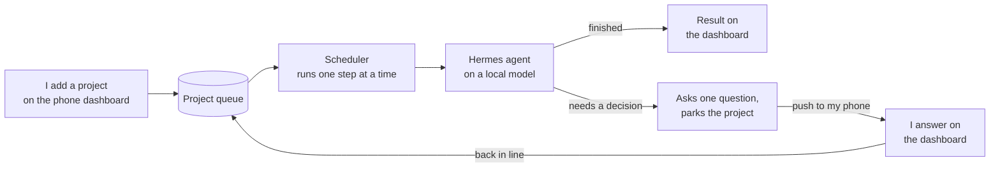
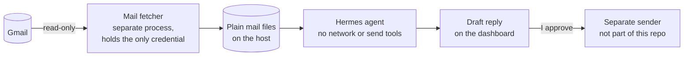

# contained-hermes-agent

An AI agent that runs entirely on a dedicated local machine. I use it to take sensitive or
repetitive work off my main computer without sending the content to a cloud provider, and to run
bulk jobs that would otherwise be billed per token by an API.

The agent works through a queue of projects one step at a time. When it reaches a decision it
cannot make alone, it asks one question, parks that project, and moves to the next. I answer from
my phone and it picks the project back up.

Most of the code here is the containment around the agent. The design assumes the agent can be
manipulated by anything it reads, and limits what that manipulation could accomplish.

## How it works

How a project runs:



How mail reaches the agent, and how a reply goes out:



1. I add a project from the phone dashboard. It lands in the queue as a JSON file.
2. The scheduler picks the most urgent item and runs one step of it on the local model. Only
   one step runs at a time, since a laptop-class machine can only run one inference at once.
3. If the agent needs a decision, it writes one question into the project and parks it. My
   phone gets a push, I answer on the dashboard, and the project goes back in line.
4. Mail reaches the agent only as plain files. A separate fetcher, which the agent cannot
   control, holds a read-only Gmail credential and writes each message to disk. The agent reads
   those files with no network tool and no send tool.
5. Anything that would leave the machine, such as a reply, comes out as a draft. Sending is a
   separate step I approve, done by code outside the agent.
6. Every action goes to an append-only audit log. Risky events push an alert to my phone right
   away.

The host is a 16 GB Apple Silicon machine with an encrypted disk, running a mid-size quantized
model on a local inference server at `http://127.0.0.1:11434/v1`. The phone, my workstation
and the host share a private WireGuard network, so the dashboard and push notifications never
pass through a third party.

## Why this exists

The first reason is cost. Triaging a mailbox, summarizing a backlog or writing first drafts
spends frontier-model tokens on work a 14B-class local model can handle. Running it locally
costs electricity instead. Frontier models are still available one question at a time when I
ask for them.

The second is privacy. The tasks most worth automating often involve content I would rather not
hand to a third party. Running the model locally covers half of that. The other half is making
sure the agent cannot send the data out itself, which is what most of the design below does.

## Threat model

I treat the agent as untrusted from the moment it reads an email.

The realistic attack is indirect prompt injection. Text inside a document or message persuades
the agent to misuse access it legitimately has: sending, deleting, leaking, or writing itself a
new capability. Nothing on the machine would look suspicious to a scanner, because the agent is
acting normally with valid credentials.

That leads to two rules that shape most of this repo:

1. The model cannot decide whether an action is allowed. A model that can be talked into an
   action can also be talked into reporting that it did not take it. Limits have to be enforced
   by code the agent does not call, using credentials the agent does not hold.
2. Spotting a leak after the fact does not undo it. So most of the effort goes into preventing
   one (the outbound block, least-privilege credentials, limited tools), and the rest into
   detecting problems (the monitoring tiers). Prevention was built first.

See [docs/security-model.md](docs/security-model.md).

## How containment works

| Control | What it does |
|---|---|
| Outbound traffic blocked by default | A compromised agent has nowhere to send anything. This is the most useful single control. |
| Mail fetched by a separate process | A trusted non-agent process fetches mail read-only into plain local files. The agent never holds the mail credential and never makes a network call. |
| Minimal tools per task | Triage runs with memory-only tools: no network tool and no send tool. An injection that persuades the model has nothing to act with. |
| Approval outside the agent | The agent produces a draft, and a separate human-approved path does the send. This is enforced outside the agent, because unattended runs skip the harness's own prompts. |
| Least-privilege credentials | A read-only OAuth scope, re-checked by the fetcher at startup. It exits if the token allows anything broader. |
| Mechanical audit | Every action is appended to a JSONL log and compared against allowlists by code. A model may reformat the digest for reading, but it does not do the checking. |

## Repo layout

```
docs/
  architecture.md      the design, and the reasoning behind each decision
  security-model.md    threat model and the control list
  monitoring-tiers.md  the A/B/C/D audit design
  orchestrator.md      project state machine and async scheduling
  email-ingestion.md   the out-of-band read-only mail pipeline
  deployment.md        standing the host up, in order, with the firewall last
scripts/
  audit_logger.py      Tier A - append-only JSONL + new-vs-known classification
  alert.py             Tier B - real-time push for high-blast-radius events
  workflow_digest.py   Tier C - per-workflow summary
  nightly_rollup.py    Tier D - trends and anomalies
  daily_digest.py      morning health push that doubles as a liveness check
  hub.py               mesh-only API + mobile dashboard (stdlib, no framework)
  gmail_auth.py        one-time read-only OAuth mint (loopback + PKCE, stdlib)
  gmail_fetch.py       read-only fetcher -> inert inbox records
  draft_reply.py       local model drafts a reply; never sends
  orchestrator/
    scheduler.py       single-flight loop: pick, step, persist, repeat
    cloud_ask.py       optional per-question cloud escalation
config/                templates only - no real configuration is committed
allowlists/            known hosts / skills / credential-uses
inbox/  projects/      record schemas and examples
```

## Implementation notes

The hub, the dashboard, the OAuth flow, the mail client and the scheduler use no third-party
packages. With outbound traffic blocked, installing anything is deliberate work, and each
dependency is one more thing that can make network calls. The Gmail API is plain REST and JSON,
so token refresh, list and get are a handful of `urllib` calls.

Every place the code depends on the model's output format has a code-level backup. Small local
models drift from formatting instructions: they bullet required markers, wrap fields across
lines, and re-ask questions that were already answered. The parsers have layered fallbacks, and
a counter ends a clarification loop that runs too long.

Limiting each task's tools does two jobs. It is the security control, and it is also the main
speed improvement: the full tool description block is tens of kilobytes, reprocessed on every
turn, and on a laptop-class host that dominates how long each step takes.

Switching modes does not require a redeploy. `config/mode.env` decides whether the scheduler
works the queue or sits idle, and it is read on every loop.

Escalation falls back in order. A cloud question tries Claude, then ChatGPT, then the local
model, and the answer notes what failed along the way, so a plan limit or a missing CLI still
produces an answer.

The daily digest arrives on a schedule, so a missing digest is the warning sign. A host that has
stopped working cannot report that itself.

## Status

This is a personal reference implementation, published as a portfolio piece. The code is the
real implementation, and the docs describe the design and the reasoning behind it. Running it
means following [docs/deployment.md](docs/deployment.md) on a host you control, and the
security properties depend on the host-level controls described there being in place.

Built on the [Hermes Agent](https://github.com/NousResearch/hermes-agent) harness and an
OpenAI-compatible local inference server. Both can be swapped: the harness is called as a
subprocess behind one constant, and the model endpoint is one line of config.
